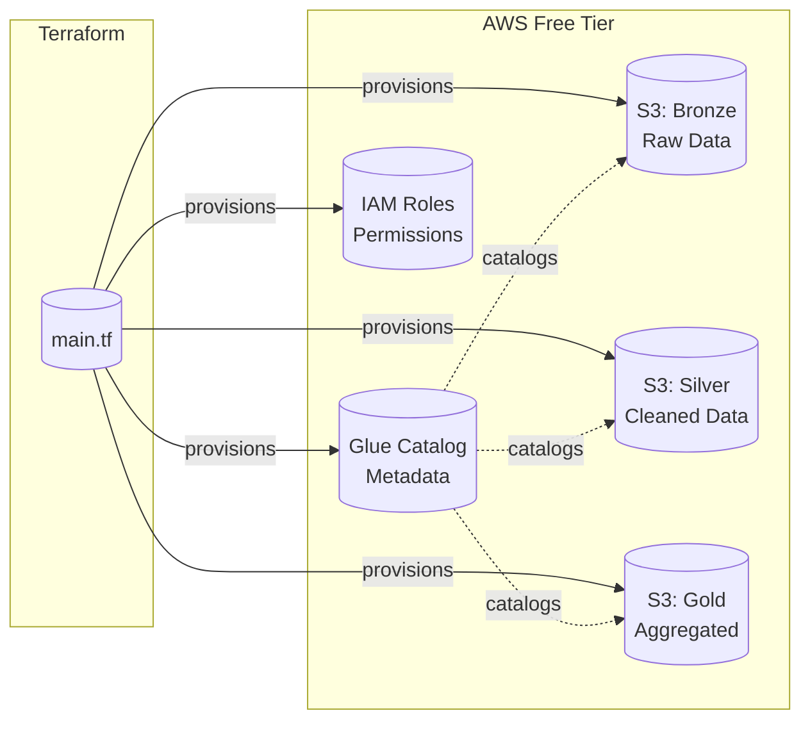

# Step 1: Infrastructure Setup

Provision cloud infrastructure using Terraform with AWS Free Tier.



---

## 📋 What Gets Created

| Resource | Purpose | Free Tier Limit |
|----------|---------|-----------------|
| S3 Bucket (Bronze) | Raw JSON storage | 5GB combined |
| S3 Bucket (Silver) | Cleaned Parquet files | 5GB combined |
| S3 Bucket (Gold) | Aggregated analytics | 5GB combined |
| Glue Database | Metadata catalog | 1M objects free |
| Glue Crawlers | Schema discovery | 1M objects free |
| IAM Roles | Service permissions | Unlimited |

---

## 🚀 Quick Start

### Prerequisites

```bash
# Install Terraform
brew install terraform  # macOS
# or
choco install terraform  # Windows

# Verify installation
terraform --version

# Configure AWS CLI
aws configure
```

### Deploy

```bash
cd 01-infrastructure

# Initialize Terraform
terraform init

# Preview changes
terraform plan

# Apply infrastructure
terraform apply

# Save outputs for other steps
terraform output -json > ../config/infrastructure.json
```

---

## 📁 Files

| File | Purpose |
|------|---------|
| `main.tf` | Primary infrastructure definitions |
| `variables.tf` | Configurable parameters |
| `outputs.tf` | Export values for other services |
| `providers.tf` | AWS provider configuration |
| `iam.tf` | IAM roles and policies |

---

## 🔧 Configuration

Edit `variables.tf` to customize:

```hcl
# Change project name (affects all resource names)
variable "project_name" {
  default = "job-analytics"
}

# Change AWS region
variable "aws_region" {
  default = "us-east-1"  # Best free tier availability
}

# Environment tag
variable "environment" {
  default = "dev"
}
```

---

## 💰 Cost Optimization

This setup stays within AWS Free Tier:

| Service | Free Tier | Our Usage |
|---------|-----------|-----------|
| S3 Storage | 5 GB | ~2-3 GB |
| S3 Requests | 20,000 GET | ~5,000/month |
| Glue Catalog | 1M objects | ~1,000 objects |
| Glue Crawlers | 1M objects | ~1,000 objects |

### Tips to Stay Free

1. Enable S3 lifecycle policies (auto-delete old data)
2. Use Parquet compression (70% space savings)
3. Run crawlers on-demand, not scheduled
4. Monitor usage in AWS Cost Explorer

---

## 🧹 Cleanup

```bash
# Destroy all resources
terraform destroy

# Remove local state
rm -rf .terraform terraform.tfstate*
```

---

## 🔗 Next Step

Continue to **[Step 2: Data Ingestion](../02-ingestion/README.md)**
