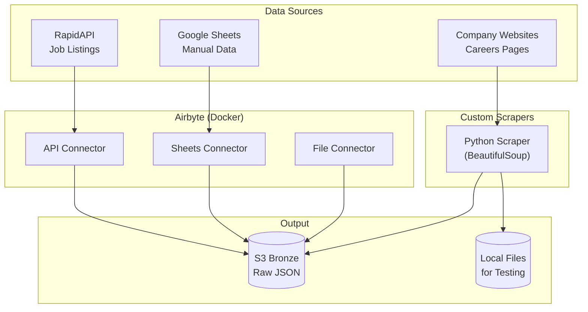

# Step 2: Data Ingestion

Ingest job market data using Airbyte (open-source) and custom Python scrapers.



---

## 📋 Data Sources

| Source | Type | Free Tier | Data |
|--------|------|-----------|------|
| RapidAPI Jobs | API | 500 req/month | Job listings |
| Google Sheets | Connector | Unlimited | Manual tracking |
| Custom Scraper | Python | Unlimited | Company careers |

---

## 🚀 Quick Start

### Option A: Airbyte (Recommended)

```bash
cd 02-ingestion

# Start Airbyte
docker-compose up -d

# Wait for startup (~2 minutes)
docker-compose logs -f

# Access UI at http://localhost:8000
```

### Option B: Custom Scrapers Only

```bash
cd 02-ingestion/scrapers

# Install dependencies
pip install -r requirements.txt

# Run scraper
python job_scraper.py --output ../data/raw
```

---

## 📁 Files

```
02-ingestion/
├── docker-compose.yml      # Airbyte setup
├── airbyte/
│   └── connections.json    # Pre-configured connections
├── scrapers/
│   ├── job_scraper.py      # Main scraper script
│   ├── companies.yaml      # Target companies config
│   └── requirements.txt    # Python dependencies
└── data/
    └── raw/                # Local output (gitignored)
```

---

## 🔧 Airbyte Setup

### 1. Access Airbyte UI

Navigate to http://localhost:8000 after starting Docker.

### 2. Create Sources

**RapidAPI Source:**
1. Sources → New Source → HTTP API
2. URL: `https://jsearch.p.rapidapi.com/search`
3. Headers: Add your RapidAPI key
4. Query params: `query=data engineer&num_pages=1`

**Google Sheets Source:**
1. Sources → New Source → Google Sheets
2. Authenticate with Google
3. Select your tracking spreadsheet

### 3. Create Destination

**S3 Destination:**
1. Destinations → New Destination → S3
2. Bucket: Your bronze bucket from Step 1
3. Path: `job_postings/airbyte/`
4. Format: JSON Lines

### 4. Create Connection

1. Connections → New Connection
2. Select source and destination
3. Schedule: Manual or Daily
4. Sync mode: Full refresh

---

## 🕷️ Custom Scraper

The scraper supports multiple company career pages:

```bash
# Scrape all configured companies
python job_scraper.py

# Scrape specific company
python job_scraper.py --company greenhouse

# Output to S3 directly
python job_scraper.py --output s3://your-bucket/job_postings/scraped/
```

### Adding New Companies

Edit `companies.yaml`:

```yaml
companies:
  - name: anthropic
    careers_url: https://www.anthropic.com/careers
    selector: ".job-listing"
    fields:
      title: ".job-title"
      location: ".job-location"
      department: ".job-department"
```

---

## 💾 Output Schema

All ingested data follows this schema:

```json
{
  "job_id": "unique-identifier",
  "title": "Senior Data Engineer",
  "company": "Example Corp",
  "location": "New York, NY",
  "salary_min": 150000,
  "salary_max": 200000,
  "description": "Full job description...",
  "posted_date": "2024-01-15",
  "source": "rapidapi|scraper|sheets",
  "scraped_at": "2024-01-20T10:30:00Z",
  "raw_data": { /* original response */ }
}
```

---

## 🧪 Testing

```bash
# Test scraper locally
python job_scraper.py --test --company greenhouse

# Validate output schema
python validate_schema.py data/raw/*.json
```

---

## 💰 Free Tier Limits

| Service | Limit | Mitigation |
|---------|-------|------------|
| RapidAPI | 500 req/month | Cache responses, batch requests |
| Airbyte | Self-hosted | No limits |
| Google Sheets | 500 req/100s | Rate limiting built-in |

---

## 🔗 Next Step

Continue to **[Step 3: Data Processing](../03-processing/README.md)**
