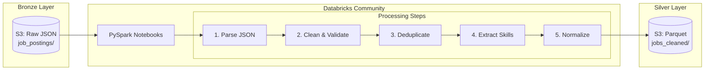

# Step 3: Data Processing

Transform raw JSON data into clean, structured Parquet files using PySpark on Databricks Community Edition.



---

## 📋 Processing Steps

| Step | Description | Output |
|------|-------------|--------|
| 1. Parse JSON | Read raw JSONL files | DataFrame |
| 2. Clean & Validate | Remove nulls, fix types | DataFrame |
| 3. Deduplicate | Remove duplicate jobs | DataFrame |
| 4. Extract Skills | NLP skill extraction | DataFrame + skills array |
| 5. Normalize | Standardize formats | Parquet files |

---

## 🚀 Quick Start

### Option A: Databricks Community Edition (Recommended)

1. **Sign up** at [community.cloud.databricks.com](https://community.cloud.databricks.com)

2. **Create Cluster** with these settings:
   - Runtime: 13.3 LTS (Spark 3.4.1)
   - Node type: Default (15GB memory)

3. **Import Notebooks**:
   - Workspace → Import → Upload `notebooks/*.py`

4. **Configure S3 Access**:
   ```python
   # In notebook cell
   spark.conf.set("fs.s3a.access.key", dbutils.secrets.get("aws", "access_key"))
   spark.conf.set("fs.s3a.secret.key", dbutils.secrets.get("aws", "secret_key"))
   ```

5. **Run Pipeline**:
   - Execute `01_bronze_to_silver.py`

### Option B: Local PySpark

```bash
cd 03-processing

# Install dependencies
pip install -r requirements.txt

# Run processing
python notebooks/01_bronze_to_silver.py --input ./data/raw --output ./data/silver
```

---

## 📁 Files

```
03-processing/
├── notebooks/
│   ├── 01_bronze_to_silver.py      # Main processing notebook
│   ├── 02_skill_extraction.py      # NLP skill parsing
│   └── 03_data_profiling.py        # Data quality analysis
├── src/
│   ├── transformations.py          # Reusable transforms
│   ├── validators.py               # Data validation rules
│   └── skill_extractor.py          # Skill extraction logic
├── tests/
│   └── test_transformations.py     # Unit tests
└── requirements.txt
```

---

## 🔧 Configuration

### S3 Paths

Update these in the notebook or via environment variables:

```python
CONFIG = {
    "bronze_path": "s3a://job-analytics-bronze-xxxx/job_postings/",
    "silver_path": "s3a://job-analytics-silver-xxxx/jobs_cleaned/",
    "checkpoint_path": "s3a://job-analytics-silver-xxxx/_checkpoints/"
}
```

### Spark Settings (for large datasets)

```python
spark.conf.set("spark.sql.shuffle.partitions", "8")  # Reduce for small data
spark.conf.set("spark.sql.adaptive.enabled", "true")
spark.conf.set("spark.sql.parquet.compression.codec", "snappy")
```

---

## 📊 Output Schema

After processing, the Silver layer contains:

```python
jobs_cleaned/
├── _SUCCESS
├── part-00000-*.snappy.parquet
└── ...

# Schema
root
 |-- job_id: string (nullable = false)
 |-- title: string (nullable = false)
 |-- title_normalized: string (nullable = true)
 |-- company: string (nullable = false)
 |-- company_normalized: string (nullable = true)
 |-- location: string (nullable = true)
 |-- city: string (nullable = true)
 |-- state: string (nullable = true)
 |-- country: string (nullable = true)
 |-- is_remote: boolean (nullable = true)
 |-- salary_min: double (nullable = true)
 |-- salary_max: double (nullable = true)
 |-- salary_currency: string (nullable = true)
 |-- job_type: string (nullable = true)
 |-- description: string (nullable = true)
 |-- skills: array<string> (nullable = true)
 |-- posted_date: date (nullable = true)
 |-- scraped_at: timestamp (nullable = false)
 |-- source: string (nullable = false)
 |-- processing_date: date (nullable = false)
```

---

## 💰 Free Tier Considerations

### Databricks Community Edition Limits

| Resource | Limit | Workaround |
|----------|-------|------------|
| Cluster size | 15GB RAM | Process in batches |
| Auto-termination | 2 hours | Save checkpoints |
| No job scheduler | — | Use Airflow |
| No Delta Lake | — | Use Parquet |

### Optimization Tips

1. **Partition by date**: Reduces scan time
   ```python
   df.write.partitionBy("processing_date").parquet(output_path)
   ```

2. **Coalesce small files**: Avoid too many small files
   ```python
   df.coalesce(4).write.parquet(output_path)
   ```

3. **Cache frequently used data**:
   ```python
   df.cache()
   ```

---

## 🧪 Testing

```bash
# Run unit tests
cd 03-processing
pytest tests/

# Test with sample data
python notebooks/01_bronze_to_silver.py --test --sample-size 100
```

---

## 🔗 Next Step

Continue to **[Step 4: Data Transformation](../04-transformation/README.md)**
