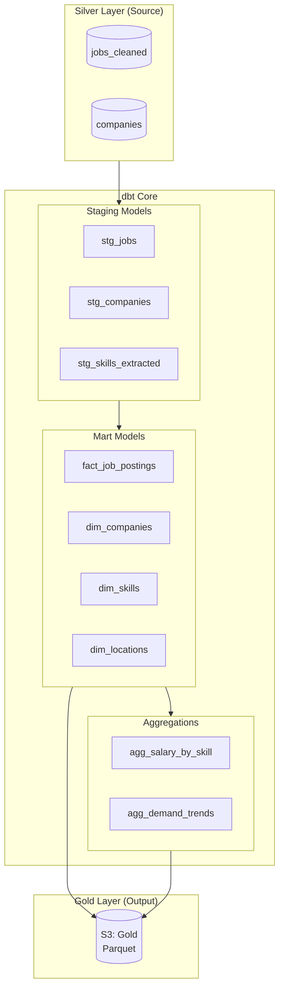

# Step 4: Data Transformation

Build dimensional models using dbt Core for SQL-based transformations.



---

## 📋 Model Overview

| Layer | Model | Description |
|-------|-------|-------------|
| **Staging** | `stg_jobs` | Cleaned job postings |
| **Staging** | `stg_companies` | Unique companies |
| **Staging** | `stg_skills` | Exploded skills array |
| **Marts** | `fact_job_postings` | Core fact table |
| **Marts** | `dim_companies` | Company dimension |
| **Marts** | `dim_skills` | Skills dimension |
| **Marts** | `dim_locations` | Location dimension |
| **Aggs** | `agg_salary_by_skill` | Salary stats by skill |
| **Aggs** | `agg_demand_trends` | Skill demand over time |

---

## 🚀 Quick Start

### Prerequisites

```bash
# Install dbt Core
pip install dbt-core dbt-duckdb

# For Databricks/Spark
pip install dbt-spark

# Verify installation
dbt --version
```

### Setup

```bash
cd 04-transformation

# Install dependencies
dbt deps

# Test connection
dbt debug

# Run models
dbt run

# Run tests
dbt test

# Generate docs
dbt docs generate
dbt docs serve
```

---

## 📁 Project Structure

```
04-transformation/
├── dbt_project.yml           # Project configuration
├── profiles.yml              # Connection profiles
├── packages.yml              # Dependencies
├── models/
│   ├── staging/              # Silver → Staging
│   │   ├── _staging.yml      # Schema & tests
│   │   ├── stg_jobs.sql
│   │   ├── stg_companies.sql
│   │   └── stg_skills.sql
│   └── marts/                # Staging → Gold
│       ├── _marts.yml        # Schema & tests
│       ├── fact_job_postings.sql
│       ├── dim_companies.sql
│       ├── dim_skills.sql
│       ├── dim_locations.sql
│       └── aggregates/
│           ├── agg_salary_by_skill.sql
│           └── agg_demand_trends.sql
├── macros/                   # Reusable SQL
│   └── generate_surrogate_key.sql
├── seeds/                    # Static reference data
│   ├── skill_categories.csv
│   └── location_mapping.csv
└── tests/                    # Custom data tests
    └── assert_positive_salary.sql
```

---

## 🔧 Configuration

### profiles.yml (for local DuckDB)

```yaml
job_analytics:
  target: dev
  outputs:
    dev:
      type: duckdb
      path: ../data/job_analytics.duckdb
      threads: 4
    
    # For Databricks (production)
    prod:
      type: spark
      method: http
      schema: job_analytics_gold
      host: "{{ env_var('DATABRICKS_HOST') }}"
      token: "{{ env_var('DATABRICKS_TOKEN') }}"
      cluster: "{{ env_var('DATABRICKS_CLUSTER') }}"
```

### dbt_project.yml

```yaml
name: 'job_analytics'
version: '1.0.0'

profile: 'job_analytics'

model-paths: ["models"]
seed-paths: ["seeds"]
test-paths: ["tests"]
macro-paths: ["macros"]

models:
  job_analytics:
    staging:
      +materialized: view
    marts:
      +materialized: table
      aggregates:
        +materialized: table
```

---

## 📊 Key Models

### fact_job_postings

Central fact table for job posting analysis:

```sql
-- Key columns
job_key           -- Surrogate key
job_id            -- Natural key
title_normalized  -- Standardized title
company_key       -- FK to dim_companies
location_key      -- FK to dim_locations
salary_min/max    -- Compensation range
posted_date       -- When posted
is_remote         -- Remote flag
skill_count       -- Number of skills required
```

### dim_skills

Skills dimension with categories:

```sql
-- Key columns
skill_key         -- Surrogate key
skill_name        -- Original skill name
skill_category    -- Category (language, cloud, database, etc.)
job_count         -- Jobs requiring this skill
avg_salary        -- Average salary for skill
```

---

## 🧪 Testing

### Built-in Tests

```yaml
# In _marts.yml
models:
  - name: fact_job_postings
    columns:
      - name: job_key
        tests:
          - unique
          - not_null
      - name: salary_min
        tests:
          - dbt_expectations.expect_column_values_to_be_between:
              min_value: 0
              max_value: 1000000
```

### Run Tests

```bash
# Run all tests
dbt test

# Run specific model tests
dbt test --select fact_job_postings

# Run only schema tests
dbt test --select test_type:schema
```

---

## 📈 Usage Examples

### Query Skills by Demand

```sql
SELECT 
    skill_name,
    skill_category,
    job_count,
    avg_salary
FROM {{ ref('dim_skills') }}
ORDER BY job_count DESC
LIMIT 20
```

### Salary Analysis by Location

```sql
SELECT 
    l.city,
    l.state,
    COUNT(*) as job_count,
    AVG(f.salary_min) as avg_salary_min,
    AVG(f.salary_max) as avg_salary_max
FROM {{ ref('fact_job_postings') }} f
JOIN {{ ref('dim_locations') }} l ON f.location_key = l.location_key
WHERE f.salary_min IS NOT NULL
GROUP BY l.city, l.state
ORDER BY avg_salary_max DESC
```

---

## 💰 Free Tier Notes

- **dbt Core**: Completely free, unlimited
- **dbt Cloud**: Free tier includes 1 developer seat
- **DuckDB**: Free, great for development
- **Storage**: Output goes to S3 (5GB free tier)

---

## 🔗 Next Step

Continue to **[Step 5: Data Quality](../05-quality/README.md)**
