# Step 5: Data Quality

Validate data quality using Great Expectations (open-source).

```mermaid
flowchart LR
    subgraph INPUT["Data Sources"]
        BRONZE[("Bronze Layer")]
        SILVER[("Silver Layer")]
        GOLD[("Gold Layer")]
    end
    
    subgraph GX["Great Expectations"]
        SUITE["Expectation<br/>Suites"]
        CHECK["Checkpoint<br/>Runner"]
        DOCS["Data<br/>Docs"]
    end
    
    subgraph OUTPUT["Results"]
        PASS["✓ Pass"]
        FAIL["✗ Fail"]
        REPORT["HTML<br/>Reports"]
    end
    
    INPUT --> SUITE
    SUITE --> CHECK
    CHECK --> PASS
    CHECK --> FAIL
    CHECK --> DOCS
    DOCS --> REPORT
```



---

## 📋 Validation Rules

### Bronze Layer Checks
| Rule | Description | Severity |
|------|-------------|----------|
| Not null: job_id | Every job must have ID | Critical |
| Not null: title | Job title required | Critical |
| Not null: company | Company required | Critical |
| Valid JSON | raw_data must parse | Warning |

### Silver Layer Checks
| Rule | Description | Severity |
|------|-------------|----------|
| Unique job_id | No duplicates | Critical |
| Salary range | $20K - $500K | Warning |
| Valid dates | posted_date <= today | Warning |
| Skills array | Non-empty array | Warning |

### Gold Layer Checks
| Rule | Description | Severity |
|------|-------------|----------|
| Referential integrity | FK relationships valid | Critical |
| Aggregate accuracy | Totals match details | Critical |
| No orphan records | All FKs resolve | Warning |

---

## 🚀 Quick Start

### Installation

```bash
cd 05-quality

# Install Great Expectations
pip install great_expectations

# Initialize project
great_expectations init
```

### Run Validations

```bash
# Run all checkpoints
great_expectations checkpoint run job_postings_checkpoint

# Run specific suite
great_expectations checkpoint run silver_layer_checkpoint

# View results
great_expectations docs build
```

---

## 📁 Project Structure

```
05-quality/
├── great_expectations/
│   ├── great_expectations.yml      # Main config
│   ├── expectations/               # Expectation suites
│   │   ├── bronze_jobs_suite.json
│   │   ├── silver_jobs_suite.json
│   │   └── gold_facts_suite.json
│   ├── checkpoints/                # Checkpoint configs
│   │   ├── bronze_checkpoint.yml
│   │   ├── silver_checkpoint.yml
│   │   └── gold_checkpoint.yml
│   ├── plugins/                    # Custom expectations
│   │   └── custom_expectations.py
│   └── uncommitted/                # Local data docs
│       └── data_docs/
├── scripts/
│   ├── run_validations.py          # CLI runner
│   └── setup_expectations.py       # Suite generator
└── requirements.txt
```

---

## 🔧 Configuration

### great_expectations.yml

```yaml
config_version: 3.0
datasources:
  silver_s3:
    class_name: Datasource
    execution_engine:
      class_name: SparkDFExecutionEngine
    data_connectors:
      default_inferred_connector:
        class_name: InferredAssetS3DataConnector
        bucket: job-analytics-silver-xxxx
        prefix: jobs_cleaned/

stores:
  expectations_store:
    class_name: ExpectationsStore
    store_backend:
      class_name: TupleFilesystemStoreBackend
      base_directory: expectations/

  validations_store:
    class_name: ValidationsStore
    store_backend:
      class_name: TupleFilesystemStoreBackend
      base_directory: uncommitted/validations/

data_docs_sites:
  local_site:
    class_name: SiteBuilder
    store_backend:
      class_name: TupleFilesystemStoreBackend
      base_directory: uncommitted/data_docs/local_site/
```

---

## 📊 Sample Expectations

### Silver Jobs Suite

```python
# Unique primary key
validator.expect_column_values_to_be_unique("job_id")

# Required fields
validator.expect_column_values_to_not_be_null("job_id")
validator.expect_column_values_to_not_be_null("title")
validator.expect_column_values_to_not_be_null("company")

# Salary validation
validator.expect_column_values_to_be_between(
    "salary_min",
    min_value=20000,
    max_value=500000,
    mostly=0.95  # Allow 5% exceptions
)

# Date validation
validator.expect_column_values_to_be_dateutil_parseable("posted_date")

# Skills array
validator.expect_column_values_to_not_be_null("skills")

# Source validation
validator.expect_column_values_to_be_in_set(
    "source",
    ["rapidapi", "greenhouse", "lever", "airbyte"]
)
```

---

## 🧪 Running Validations

### Via Python Script

```python
from scripts.run_validations import run_all_checks

# Run all validations
results = run_all_checks()

# Check results
for checkpoint, result in results.items():
    status = "✓" if result["success"] else "✗"
    print(f"{status} {checkpoint}: {result['statistics']}")
```

### Via Airflow

```python
# In Airflow DAG
from great_expectations_provider.operators.great_expectations import (
    GreatExpectationsOperator
)

validate_silver = GreatExpectationsOperator(
    task_id="validate_silver_layer",
    checkpoint_name="silver_checkpoint",
    data_context_root_dir="/path/to/great_expectations"
)
```

---

## 📈 Data Docs

Great Expectations generates beautiful HTML reports:

```bash
# Build and open docs
great_expectations docs build --open
```

Reports include:
- Validation results over time
- Expectation suite documentation
- Data profiling statistics
- Failure drill-downs

---

## 💰 Free Tier Notes

- **Great Expectations**: 100% open source, unlimited
- **Storage**: Uses local filesystem or S3
- **No cloud features**: Self-hosted only

---

## 🔗 Next Step

Continue to **[Step 6: Orchestration](../06-orchestration/README.md)**
