# Step 6: Orchestration

Schedule and monitor the entire pipeline using Apache Airflow (Docker).

```mermaid
flowchart TB
    subgraph SCHEDULER["Airflow Scheduler"]
        DAG["job_analytics_dag"]
    end
    
    subgraph TASKS["Pipeline Tasks"]
        T1["1. Scrape Jobs"]
        T2["2. Process Bronze→Silver"]
        T3["3. Run dbt Models"]
        T4["4. Validate Quality"]
        T5["5. Update Catalog"]
        T6["6. Refresh Dashboard"]
        T7["7. Send Alerts"]
    end
    
    subgraph EXTERNAL["External Systems"]
        S3[("S3")]
        DBT["dbt"]
        GX["Great Expectations"]
        GLUE["Glue Catalog"]
        SLACK["Slack"]
    end
    
    DAG --> T1
    T1 --> T2
    T2 --> T3
    T3 --> T4
    T4 -->|pass| T5
    T4 -->|fail| T7
    T5 --> T6
    T6 --> T7
    
    T1 -.-> S3
    T3 -.-> DBT
    T4 -.-> GX
    T5 -.-> GLUE
    T7 -.-> SLACK
```



---

## 📋 DAG Overview

| Task | Description | Trigger |
|------|-------------|---------|
| `scrape_jobs` | Run job scrapers | Daily 6am |
| `process_bronze_silver` | Spark processing | After scrape |
| `run_dbt_models` | dbt transformations | After process |
| `validate_quality` | Great Expectations | After dbt |
| `update_catalog` | Run Glue crawlers | After validate |
| `refresh_dashboard` | Trigger dashboard refresh | After catalog |
| `send_notifications` | Slack/email alerts | On completion/failure |

---

## 🚀 Quick Start

### Start Airflow

```bash
cd 06-orchestration

# Initialize Airflow
docker-compose up airflow-init

# Start all services
docker-compose up -d

# Check status
docker-compose ps

# View logs
docker-compose logs -f airflow-webserver
```

### Access Airflow UI

- URL: http://localhost:8080
- Username: `airflow`
- Password: `airflow`

### Enable DAG

1. Open Airflow UI
2. Find `job_analytics_dag`
3. Toggle the DAG to "On"
4. Trigger manually or wait for schedule

---

## 📁 Project Structure

```
06-orchestration/
├── docker-compose.yml          # Airflow deployment
├── .env                        # Environment variables
├── dags/
│   ├── job_analytics_dag.py    # Main pipeline DAG
│   ├── maintenance_dag.py      # Cleanup/maintenance
│   └── utils/
│       ├── slack_alerts.py     # Notification helpers
│       └── s3_helpers.py       # S3 utilities
├── plugins/                    # Custom operators
│   └── custom_operators.py
├── config/
│   └── connections.yaml        # Airflow connections
├── logs/                       # Airflow logs (gitignored)
└── scripts/
    └── init_connections.py     # Setup script
```

---

## 🔧 Configuration

### Environment Variables (.env)

```bash
# Airflow
AIRFLOW_UID=50000
AIRFLOW_GID=0
_AIRFLOW_WWW_USER_USERNAME=airflow
_AIRFLOW_WWW_USER_PASSWORD=airflow

# AWS
AWS_ACCESS_KEY_ID=your_key
AWS_SECRET_ACCESS_KEY=your_secret
AWS_DEFAULT_REGION=us-east-1

# S3 Buckets
S3_BRONZE_BUCKET=job-analytics-bronze-xxxx
S3_SILVER_BUCKET=job-analytics-silver-xxxx
S3_GOLD_BUCKET=job-analytics-gold-xxxx

# Notifications (optional)
SLACK_WEBHOOK_URL=https://hooks.slack.com/...

# External APIs
RAPIDAPI_KEY=your_rapidapi_key
```

### Airflow Connections

Set up via UI or CLI:

```bash
# AWS Connection
airflow connections add 'aws_default' \
    --conn-type 'aws' \
    --conn-extra '{"region_name": "us-east-1"}'

# Slack (optional)
airflow connections add 'slack_webhook' \
    --conn-type 'http' \
    --conn-host 'hooks.slack.com' \
    --conn-schema 'https'
```

---

## 📊 Monitoring

### Task Status

The DAG sends notifications on:
- ✅ Pipeline success
- ❌ Task failure
- ⚠️ Data quality issues
- 📊 Daily summary stats

### Grafana Integration

```python
# In DAG
from airflow.providers.http.operators.http import SimpleHttpOperator

push_metrics = SimpleHttpOperator(
    task_id='push_metrics_to_grafana',
    http_conn_id='grafana_cloud',
    endpoint='/api/v1/push',
    method='POST',
    data=json.dumps(metrics)
)
```

---

## 💰 Free Tier Notes

| Component | Free Tier | Notes |
|-----------|-----------|-------|
| Airflow | Self-hosted | Docker, no limits |
| Workers | 1 worker | Scale as needed |
| Scheduler | 1 scheduler | Sufficient for daily |
| Database | SQLite | PostgreSQL for prod |

### Resource Requirements

- CPU: 2+ cores
- RAM: 4GB minimum
- Disk: 10GB for logs

---

## 🧪 Testing

```bash
# Test DAG syntax
python dags/job_analytics_dag.py

# Dry run
airflow dags test job_analytics_dag 2024-01-01

# Run single task
airflow tasks test job_analytics_dag scrape_jobs 2024-01-01
```

---

## 🔗 Next Step

Continue to **[Step 7: Visualization](../07-visualization/README.md)**
