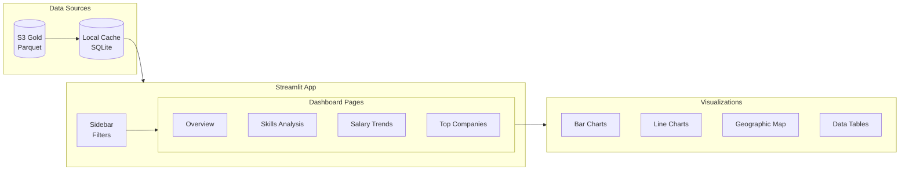

# Step 7: Visualization

Build interactive dashboards using Streamlit (free hosting on Streamlit Cloud).



---

## 📋 Dashboard Features

| Page | Description | Key Metrics |
|------|-------------|-------------|
| **Overview** | Executive summary | Total jobs, avg salary, trends |
| **Skills Analysis** | Skill demand & value | Top skills, skill premium |
| **Salary Trends** | Compensation analysis | By role, location, seniority |
| **Companies** | Employer insights | Hiring velocity, comp bands |

---

## 🚀 Quick Start

### Local Development

```bash
cd 07-visualization

# Install dependencies
pip install -r requirements.txt

# Run locally
streamlit run app/main.py

# Open browser at http://localhost:8501
```

### Deploy to Streamlit Cloud (Free)

1. Push code to GitHub
2. Go to [share.streamlit.io](https://share.streamlit.io)
3. Connect your GitHub repo
4. Select `07-visualization/app/main.py`
5. Deploy!

---

## 📁 Project Structure

```
07-visualization/
├── app/
│   ├── main.py                 # Main Streamlit app
│   ├── pages/
│   │   ├── 1_📊_Overview.py
│   │   ├── 2_🎯_Skills.py
│   │   ├── 3_💰_Salaries.py
│   │   └── 4_🏢_Companies.py
│   ├── components/
│   │   ├── charts.py           # Reusable chart components
│   │   ├── filters.py          # Sidebar filters
│   │   └── metrics.py          # KPI cards
│   └── utils/
│       ├── data_loader.py      # Data loading & caching
│       └── config.py           # App configuration
├── .streamlit/
│   └── config.toml             # Streamlit settings
├── data/                       # Local data cache (gitignored)
└── requirements.txt
```

---

## 🔧 Configuration

### .streamlit/config.toml

```toml
[theme]
primaryColor = "#FF6B6B"
backgroundColor = "#FFFFFF"
secondaryBackgroundColor = "#F0F2F6"
textColor = "#262730"
font = "sans serif"

[server]
headless = true
port = 8501

[browser]
gatherUsageStats = false
```

### Environment Variables

```bash
# For S3 data access
AWS_ACCESS_KEY_ID=your_key
AWS_SECRET_ACCESS_KEY=your_secret
AWS_DEFAULT_REGION=us-east-1

# S3 paths
S3_GOLD_BUCKET=job-analytics-gold-xxxx

# Optional: Use local data for development
USE_LOCAL_DATA=true
LOCAL_DATA_PATH=../data/gold/
```

---

## 📊 Key Visualizations

### Skill Demand Chart
```python
import plotly.express as px

fig = px.bar(
    skills_df.head(15),
    x="job_count",
    y="skill_name",
    orientation="h",
    color="skill_category",
    title="Top 15 In-Demand Skills"
)
```

### Salary Distribution
```python
fig = px.box(
    salary_df,
    x="seniority_level",
    y="salary_midpoint",
    color="role_category",
    title="Salary Distribution by Role & Seniority"
)
```

### Trend Line
```python
fig = px.line(
    trends_df,
    x="week_start",
    y="job_count",
    color="skill_name",
    title="Skill Demand Over Time"
)
```

---

## 💰 Free Tier Notes

### Streamlit Cloud Limits

| Resource | Free Tier |
|----------|-----------|
| Apps | 1 public app |
| RAM | 1GB |
| Storage | Limited |
| Viewers | Unlimited |

### Optimization Tips

1. **Cache aggressively**
   ```python
   @st.cache_data(ttl=3600)
   def load_data():
       return pd.read_parquet("s3://...")
   ```

2. **Use session state**
   ```python
   if "data" not in st.session_state:
       st.session_state.data = load_data()
   ```

3. **Sample large datasets**
   ```python
   df = full_df.sample(n=10000) if len(full_df) > 10000 else full_df
   ```

---

## 🧪 Testing

```bash
# Run with test data
USE_LOCAL_DATA=true streamlit run app/main.py

# Generate test data
python scripts/generate_test_data.py
```

---

## 📱 Mobile Support

The dashboard is responsive and works on mobile devices. Key considerations:

- Sidebar collapses on mobile
- Charts resize automatically
- Tables scroll horizontally
- Touch-friendly filters

---

## 🔗 Project Complete!

You've now built a complete data engineering pipeline:

1. ✅ **Infrastructure** - Terraform + S3 + Glue
2. ✅ **Ingestion** - Airbyte + Custom Scrapers
3. ✅ **Processing** - PySpark on Databricks
4. ✅ **Transformation** - dbt Core
5. ✅ **Quality** - Great Expectations
6. ✅ **Orchestration** - Apache Airflow
7. ✅ **Visualization** - Streamlit Dashboard

All using **free tier services**!
