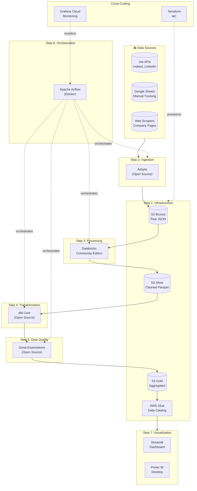
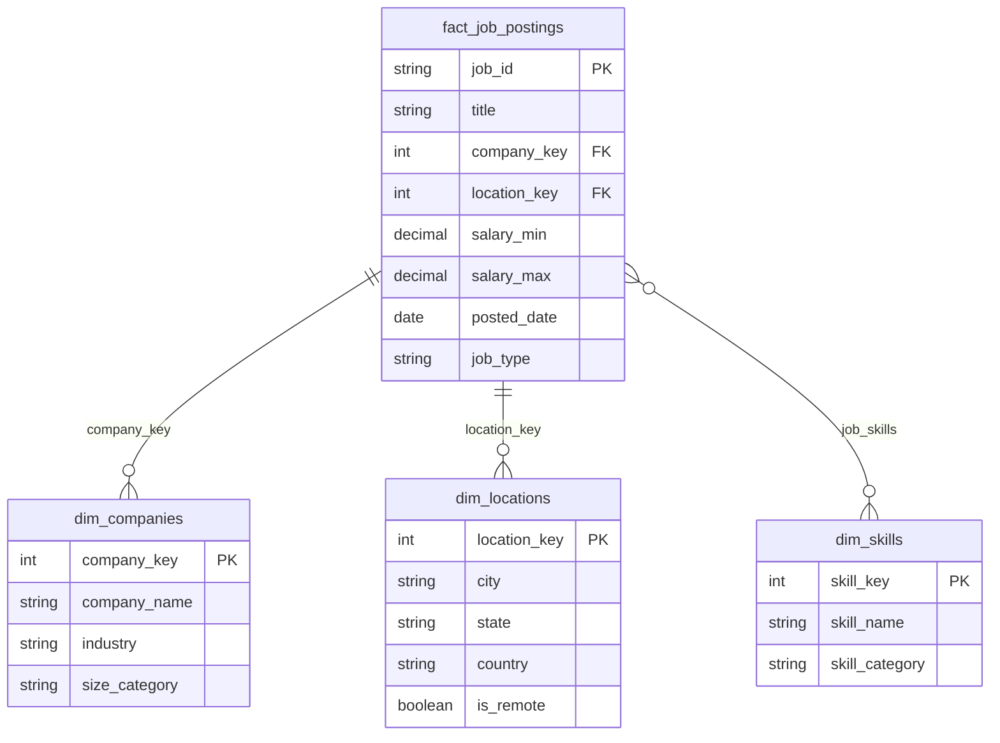

# 📊 Job Market Analytics Pipeline

A complete, production-ready data engineering portfolio project demonstrating the modern data stack using **free-tier services only**.

Track data engineering job postings, salaries, and skill trends across multiple sources with a fully automated pipeline.


---

## 🏗️ Architecture Overview



---

## 📁 Project Structure

```
job-market-analytics/
├── 01-infrastructure/          # Terraform + S3 + Glue setup
│   ├── README.md
│   ├── main.tf
│   ├── variables.tf
│   └── outputs.tf
├── 02-ingestion/               # Airbyte connectors + custom scrapers
│   ├── README.md
│   ├── docker-compose.yml
│   └── scrapers/
├── 03-processing/              # PySpark notebooks + jobs
│   ├── README.md
│   └── notebooks/
├── 04-transformation/          # dbt models (bronze → silver → gold)
│   ├── README.md
│   ├── dbt_project.yml
│   └── models/
├── 05-quality/                 # Great Expectations suites
│   ├── README.md
│   └── great_expectations/
├── 06-orchestration/           # Airflow DAGs
│   ├── README.md
│   ├── docker-compose.yml
│   └── dags/
├── 07-visualization/           # Streamlit dashboard
│   ├── README.md
│   └── app/
├── scripts/                    # Utility scripts
├── config/                     # Configuration files
├── tests/                      # Integration tests
└── docs/                       # Additional documentation
```

---

## 🚀 Quick Start

> **📖 New to this project?** Follow the complete **[Getting Started Guide](./GETTING_STARTED.md)** for detailed step-by-step instructions.

### Prerequisites

- Docker & Docker Compose
- Python 3.10+
- AWS Account (free tier)
- Databricks Community Edition account

### 1. Clone and Setup

```bash
git clone https://github.com/yourusername/job-market-analytics.git
cd job-market-analytics

# Create virtual environment
python -m venv venv
source venv/bin/activate  # Windows: venv\Scripts\activate

# Install dependencies
pip install -r requirements.txt
```

### 2. Configure AWS Credentials

```bash
aws configure
# Enter your AWS Access Key, Secret, and region (us-east-1 recommended for free tier)
```

### 3. Deploy Infrastructure

```bash
cd 01-infrastructure
terraform init
terraform plan
terraform apply
```

### 4. Start Services

```bash
# Start Airbyte
cd ../02-ingestion
docker-compose up -d

# Start Airflow
cd ../06-orchestration
docker-compose up -d
```

### 5. Access Dashboards

| Service | URL | Credentials |
|---------|-----|-------------|
| Airflow | http://localhost:8080 | airflow / airflow |
| Airbyte | http://localhost:8000 | — |
| Streamlit | http://localhost:8501 | — |
| Grafana | https://grafana.com | Your account |

---

## 🎯 Key Features

| Feature | Implementation | Free Tier Limit |
|---------|---------------|-----------------|
| **Ingestion** | Airbyte (self-hosted) | Unlimited |
| **Storage** | AWS S3 | 5GB / 12 months |
| **Processing** | Databricks Community | 15GB cluster |
| **Transformation** | dbt Core | Unlimited |
| **Quality** | Great Expectations | Unlimited |
| **Orchestration** | Airflow (Docker) | Unlimited |
| **Visualization** | Streamlit Cloud | 1 app free |
| **Monitoring** | Grafana Cloud | 10K metrics |
| **IaC** | Terraform | Unlimited |

---

## 📊 Data Model

### Bronze Layer (Raw)
- `raw_job_postings` - Unmodified API responses
- `raw_company_info` - Company metadata

### Silver Layer (Cleaned)
- `stg_jobs_cleaned` - Deduplicated, normalized jobs
- `stg_companies` - Standardized company data
- `stg_skills_extracted` - Parsed skills from descriptions

### Gold Layer (Business)
- `fact_job_postings` - Job posting facts
- `dim_companies` - Company dimension
- `dim_skills` - Skills dimension
- `dim_locations` - Location dimension
- `agg_salary_by_skill` - Salary aggregations
- `agg_demand_trends` - Skill demand over time



---

## 📈 Sample Insights

The pipeline generates actionable insights including:

- **Top 10 In-Demand Skills** by job count and salary premium
- **Salary Distributions** by role, location, and experience level
- **Remote vs On-Site Trends** over time
- **Hiring Velocity** by company
- **Skill Co-occurrence** patterns

---

## 🛠️ Technology Stack

| Layer | Technology | Why This Choice |
|-------|------------|-----------------|
| Infrastructure | Terraform | Industry-standard IaC |
| Storage | S3 + Parquet | Cost-effective, columnar |
| Catalog | AWS Glue | Native S3 integration |
| Processing | PySpark | Scalable, industry standard |
| Transformation | dbt | SQL-first, testable |
| Quality | Great Expectations | Most mature framework |
| Orchestration | Airflow | De facto standard |
| Visualization | Streamlit | Python-native, free hosting |

---

## 📚 Step-by-Step Guides

Each component has detailed documentation:

1. **[Infrastructure Setup](./01-infrastructure/README.md)** - Terraform, S3, Glue
2. **[Data Ingestion](./02-ingestion/README.md)** - Airbyte, custom scrapers
3. **[Data Processing](./03-processing/README.md)** - PySpark transformations
4. **[Data Transformation](./04-transformation/README.md)** - dbt models
5. **[Data Quality](./05-quality/README.md)** - Great Expectations
6. **[Orchestration](./06-orchestration/README.md)** - Airflow DAGs
7. **[Visualization](./07-visualization/README.md)** - Streamlit dashboard

---

## 🧪 Testing

```bash
# Run unit tests
pytest tests/

# Run data quality checks
great_expectations checkpoint run job_postings_checkpoint

# Validate dbt models
cd 04-transformation && dbt test
```

---

## 🤝 Contributing

Contributions welcome! Please read [CONTRIBUTING.md](./docs/CONTRIBUTING.md) first.

---

## 📄 License

MIT License - see [LICENSE](./LICENSE) for details.

---

## 🙏 Acknowledgments

- [Airbyte](https://airbyte.com/) for open-source data integration
- [dbt Labs](https://www.getdbt.com/) for the transformation framework
- [Great Expectations](https://greatexpectations.io/) for data quality
- [Apache Airflow](https://airflow.apache.org/) for orchestration
